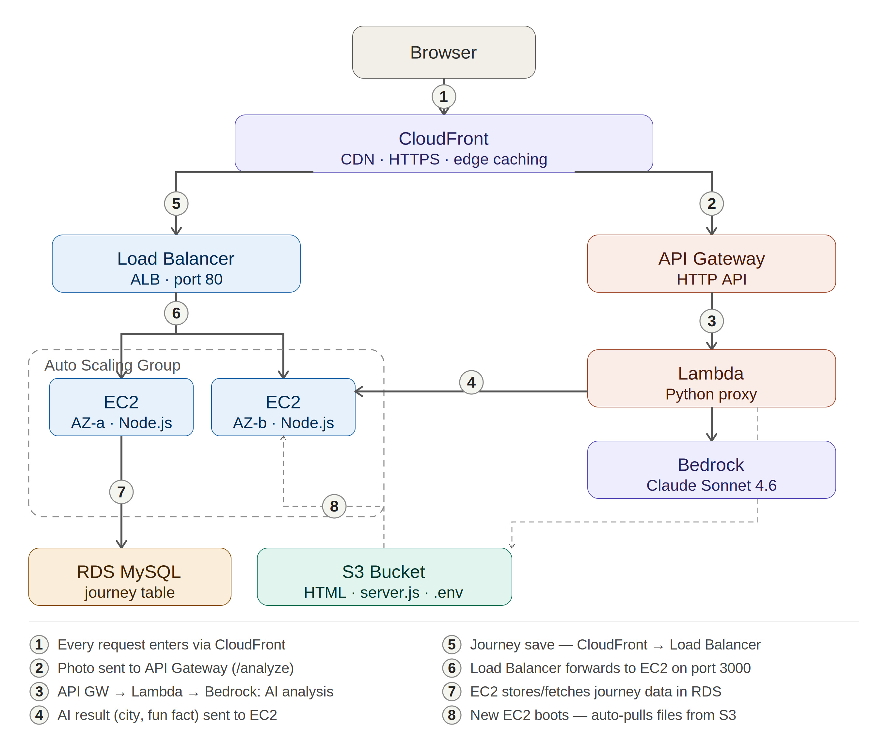

# WanderLens — Asia Travel Photo Atlas

An AI-powered travel photo atlas for Asia. Upload a photo and Claude automatically identifies the location, district, and generates a fun fact. Built on AWS with a full serverless AI pipeline.



---

## What it does

- Upload a travel photo → AI detects city, district, country and writes a fun fact
- 13 Asian destination galleries with interactive country maps
- Personal journey section with drag-and-drop reordering and public/private toggle
- Community gallery showing public photos from other users
- Fully persistent — journey data saved to MySQL via Node.js backend

---

## Tech stack

| Layer | Service |
|---|---|
| CDN / HTTPS | CloudFront |
| Static hosting | S3 |
| Backend | EC2 (Node.js + PM2) behind an ALB |
| Auto scaling | Auto Scaling Group across 2 AZs |
| Database | RDS MySQL |
| AI proxy | API Gateway → Lambda → Bedrock (Claude Sonnet 4.6) |

---

## Redeployment guide

### 1. Prerequisites
- AWS account with Bedrock Claude Sonnet 4.6 enabled
- RDS MySQL instance running (`wanderlens` database)
- S3 bucket (`wanderlen-s3`) with public static website hosting enabled
- EC2 IAM role with S3 read access attached to your Launch Template

### 2. Upload files to S3
Upload these three files to your S3 bucket:
```
wanderlens-final.html
wanderlens_server.js
.env              ← copy from .env.example and fill in your values
```

### 3. Set up the database
Connect to RDS and run the schema:
```bash
mysql -h YOUR_RDS_ENDPOINT -u admin -p < wanderlens_schema.sql
```

### 4. Deploy the frontend
In `wanderlens-final.html`, update these two constants:
```javascript
const BEDROCK_PROXY_URL = "https://YOUR_API_GATEWAY_ID.execute-api.us-east-1.amazonaws.com/analyze";
const BACKEND_URL       = "https://YOUR_CLOUDFRONT_DOMAIN.cloudfront.net";
```
Re-upload to S3.

### 5. Deploy the Lambda
- Runtime: Python 3.12
- Handler: `lambda_function.handler`
- Timeout: 30 seconds
- Permissions: `AmazonBedrockFullAccess`
- Paste the contents of `wanderlens_bedrock_lambda.py`

### 6. Launch EC2s
Paste `user_data.sh` into your Launch Template → Advanced → User data.
The ASG will launch instances that self-configure automatically.

### 7. CloudFront behaviors
| Path pattern | Origin |
|---|---|
| `/*` (default) | S3 static website |
| `/api/*` | Application Load Balancer |
| `/analyze` | API Gateway |

Set **Default root object** to `wanderlens-final.html`.

---

## Environment variables

Copy `.env.example` to `.env`, fill in your values, upload to S3.

```
PORT=3000
DB_HOST=your-rds-endpoint.rds.amazonaws.com
DB_USER=admin
DB_PASS=your_password
DB_NAME=wanderlens
```

---

## Key AWS resource names (update if yours differ)

| Resource | Name / value |
|---|---|
| S3 bucket | `wanderlen-s3` |
| RDS database | `wanderlens` |
| EC2 security group | `lunch_tamplate-sg` |
| ALB target group port | `3000` |
| Lambda handler | `lambda_function.handler` |
| Bedrock model | `us.anthropic.claude-sonnet-4-6` |
